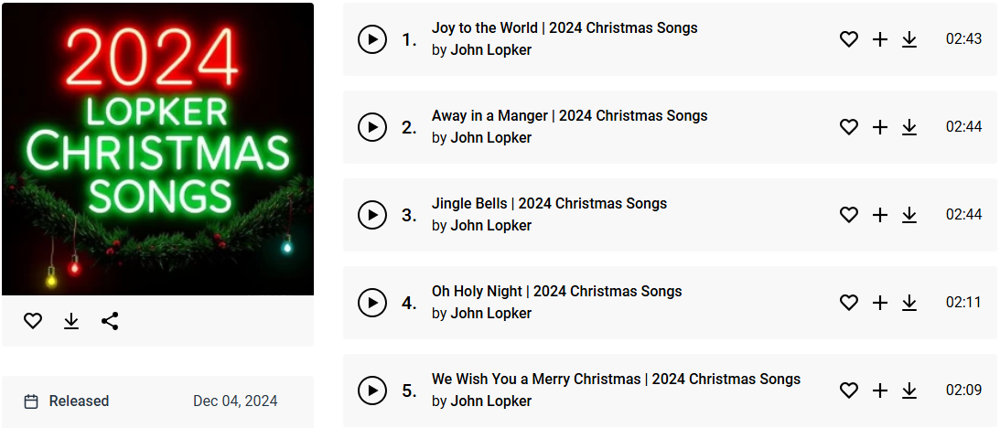

# Glitches In Christmas

**Glitches In Christmas** is an academic, creative and technical exploration into the world of AI-generated cover songs and building a machine learning algorithm to analyze sound features on vocal tracks.

## Project Highlights

  <!-- Image Column -->
  

     
    <i>AI Generated (SD1.5): bald fit alpha miwilen gentleman singing expressively opera in live christmas:1.2 gala, wearing christmas tuxedo, intense eye contact, gray beard, rich expressive dramatic performance, christmas tree, snow flakes, confetti, sparkling glitter, masterpiece, vivid intense colors, perfect quality, incredible detail, photorealistic, uhd, 4k</i>
  

  <!-- Text Column -->
  

    <h2>AI-Cover Album Creation</h2>
    <ul>
      <li>Based on a recently released album "2024 Lopker Christmas Songs" by John Lopker, licensed under <strong>CC BY</strong>, allowing derivative work.</li>
      <li>The vocals of the original songs have been reimagined using <strong>AI voice modeling</strong>, featuring a custom-trained voice model.</li>
      <li>AI-cover Christmas song album titled <strong>"24YDL Days Till Christmas"</strong> is available for download below.</li>
    </ul>
    <!-- Highly Visible Download Section -->
    

      <a href="https://drive.google.com/drive/folders/1-0rqw0uwNj_NsFwUVW3V5c0Ss5aeIsIx?usp=sharing" 
         style="display: block; font-size: 488px; font-weight: bold; color: #fff; background-color: #ff0000; padding: 40px; text-decoration: none; border-radius: 24px; margin: 40px auto; max-width: 400px;">
        🚨 Download the AI-Cover Album Here 🚨
      </a>
    

     
    

      The Christmas gala was a magical evening filled with joy and festive cheer. The live performance of the album captivated the audience with soulful AI-generated vocals and stunning visuals. The event featured dazzling light displays synchronized with the music. Families and friends gathered to celebrate the season with hot cocoa and sweet treats. Guests left inspired, carrying the holiday spirit home. <i>'Hynn Hynn, Yeah...'</i>
    

  

## RVC Demonstration

To showcase how the RVC (Retraining Voice Conversion) model works, we have provided the following audio examples:

1. **Original Vocal** ([Listen](data/rvc_example/1-original_vocal.wav))  
   This is the raw vocal track before any processing.
   <audio controls>
      <source src="data/rvc_example/1-original_vocal.wav" type="audio/wav">
      Your browser does not support the audio element.
   </audio>

2. **Training Material** ([Listen](data/rvc_example/2-training_material.wav))  
   A short clip used to train the custom AI voice model.

3. **Generated Vocal** ([Listen](data/rvc_example/3_generated_vocal.wav))  
   The AI-generated vocal output using the custom voice model.

These examples demonstrate the transformation from the original vocal to the AI-generated output. They provide insight into the capabilities of the model and serve as a practical example of how RVC can be applied in audio production.

## Anomaly Detection in AI cover songs
   - Fitting a voice model on a vocal track may cause glitches and anomalies, slowing down post-production.
   - To address this, a **machine learning algorithm** was developed to locate and analyze these glitches effectively, as reflected in the accompanying Jupyter Notebook.
   

## License

This project is licensed under the Apache License.

## Original Album Info

[Free Music Archive](https://freemusicarchive.org/music/john-lopker/2024-lopker-christmas-songs)

